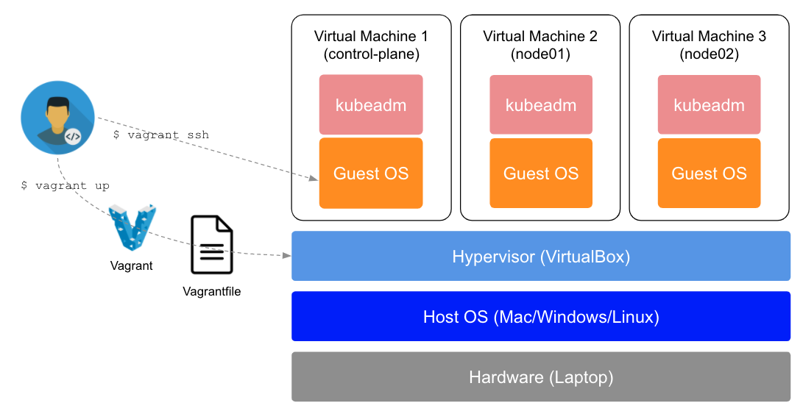
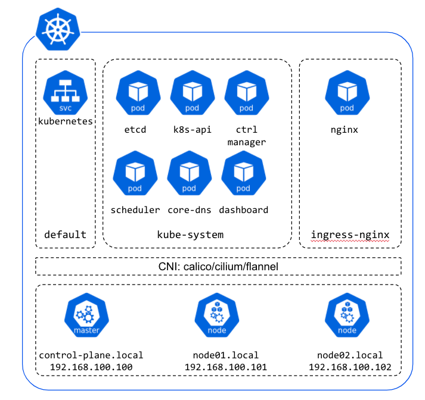

# Kubernetes cluster setup with Kubeadm, Vagrant, VirtualBox

This repository provides helps you to run a minimum best-practice Kubernetes Cluster for educational and testing purpose that can run on MacOS, Linux or Windows operating systems. This project can be extended for production usage.

VirtualBox, Vagrant and Kubeadm are used for Virtualization, VMs deployment and K8s Cluster bootstrap:

In order to run this cluster on your local machine, please go thought the following docs:

- [prerequisites](./docs/prerequisites.md)
- [cluster setup](./docs/cluster-setup.md)

The Kubernetes Cluster is described in this diagram:

