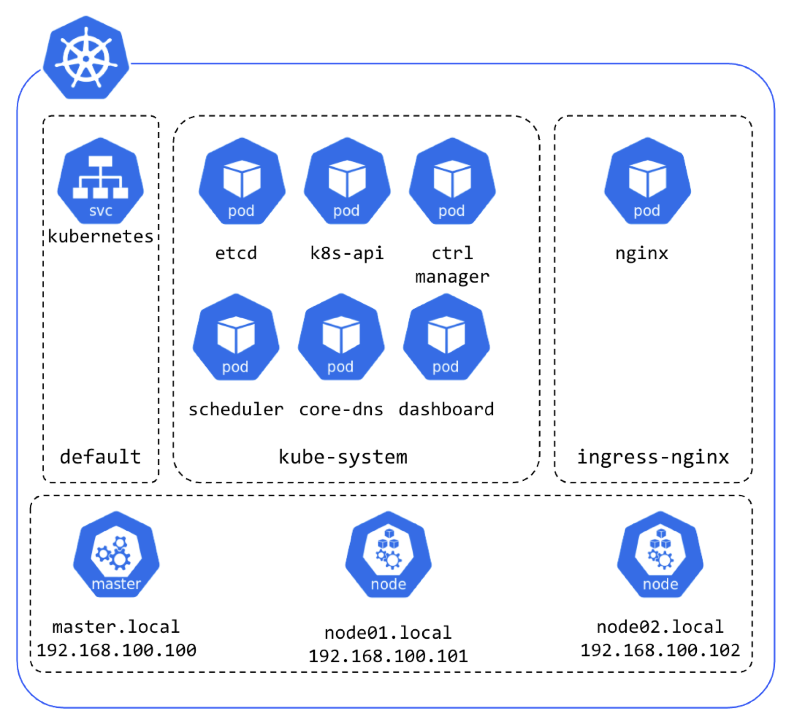

# Kuberntes cluster setup with Kubeadm, Vagrant, VirtualBox

This repository provides a bunch of scripts necessary to run a minimum local K8s cluster for testing and learning purpose. Later it can be extended for production usage.

The following software are used:
    - [VirtualBox](https://www.virtualbox.org/) for VMs Virtualization
    - [Vagrant](https://www.vagrantup.com/) for VMs template deployment
    - [Kubeadm](https://github.com/kubernetes/kubeadm) for K8s Cluster boostrap

In order to run this cluster on your local machine, please go thought the following docs:
    - [prerequisites](./docs/prerequisites.md)
    - [cluster setup](./docs/cluster_setup.md)

Here is the cluster diagram:

