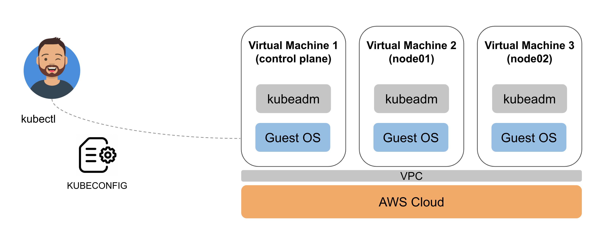

# Kubernetes cluster setup with Kubeadm, Terraform and AWS

AWS Cloud, Terraform, and Kubeadm are used for Virtualization, VMs deployment and K8s Cluster bootstrap.

In order to connect to this cluster, please go thought [prerequisites](prerequisites.md) docs.
