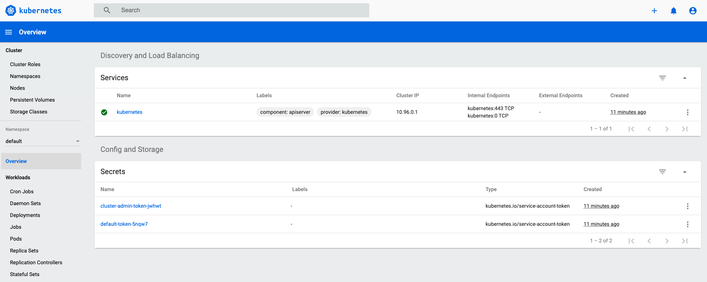

# Cluster Setup

## Bring the cluster up

a) For Mac/Linux - open the terminal and go to `labs/kubeadm-vagrant`. For
   Windows - open Git-bash and go to the `labs/kubeadm-vagrant` folder (Ex. `cd
   /c/Users/<user name>/Desktop/labs/kubeadm-vagrant`).

b) Power on the VMs:

- control-plane node: `vagrant up control-plane`. After the VM finish the
  initialization, the output should end with the message: `“Enjoy”`.
- worker nodes: `vagrant up node01` and `vagrant up node02`

c) In order to test the cluster, from your local machine open the browser and go
to: [https://k8s.local:30443](https://k8s.local:30443). You should see the K8s
Dashboard:

Note: If you are using Google Chrome, you might hit `NET::ERR_CERT_INVALID`.
Because we know this is our app, we should trust it. To bypass Google Chrome
error, type `thisisunsafe` and hit enter.

d) To authenticate to this dashboard, use the token from this file:
`kubeadm-vagrant/src/output/cluster-admin-token`.

## Setup your free dockerhub account

The images used in this project were migrated from dockerhub to github container registry.
If you run Pods with dockerhub images you need to use a dockerhub account because of the new ratelimiting policy:

- Unauthenticated users: 100 pulls / 6 hours
- Authenticated users: 200 pulls / 6 hours

So with an authenticated user you get 100 pulls more. Read also: [Docker Hub rate limits & pricing](https://www.docker.com/pricing)

In order to setup a dockerhub account for this cluster, you need to do the following:

- [Create a free dockerhub account](https://hub.docker.com/signup?redirectTo=/subscription%3Fplan%3Dindividual%26paid%3Dfalse)
- Login to `control-plane` node (`vagrant ssh control-plane`) and execute the following script: `/src/scripts/registry-cred.sh`
- Type your dockerhub `username` and `password`. A Controller named `registry-cred` will be deployed to the cluster and will replicate your dockerhub credentials in each existing and new namespace.

Enjoy;
