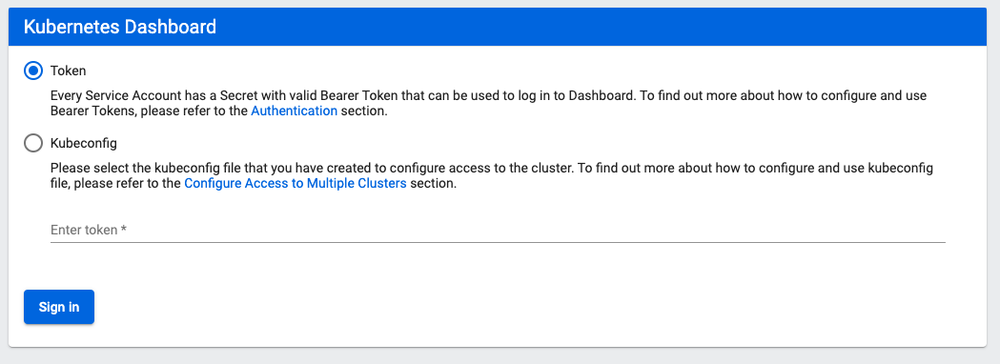

# Cluster Setup

## Bring the cluster up

a) For Mac/Linux - open the terminal and go to `labs/kubeadm-vagrant`. 
   For Windows - open Git-bash and go to the `labs/kubeadm-vagrant` folder (Ex. `cd /c/Users/<user name>/Desktop/labs/kubeadm-vagrant`).

b) Power on the VMs: 
- master node: `vagrant up master`. Afer the VM finish the initialization, the output sould end with the message: `“Enjoi.”`. 
- worker nodes: `vagrant up node01` and `vagrant up node02`

c) In order to test the cluster, from your local machine open the browser and go to: https://k8s.local:30443. You should see the K8s Dashboard:



d) To authenticate to this dashboard, use the token from this file: `kubeadm-vagrant/src/output/cluster_admin_token.txt`.


## Manage cluster with kubectl
```
export KUBECONFIG=$(pwd)/src/output/kubeconfig.yaml
kubectl cluster-info
```
or login into the master node:
```
vagrant ssh master
kubectl cluster-info
kns <my-fancy-namespace> # change the default namespace in kubeconfig
kubectl get <my-fancy-object>
```

## Manage cluster with kube-dashboard
```
Browse to https://192.168.100.100:31001
Use token generated in src/output/cluster_admin_token.txt
```

## Running one node cluster

If you want to run only the master node and be able to schedule Pods on it, remove the taint from the master:

```
kubectl taint nodes master node-role.kubernetes.io/master-
```

Enjoi;